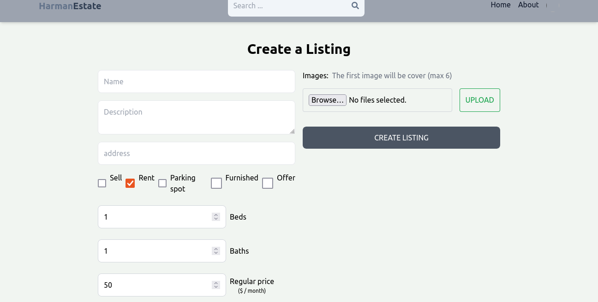
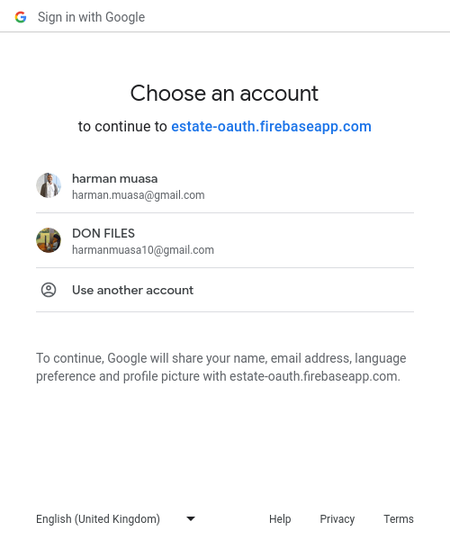
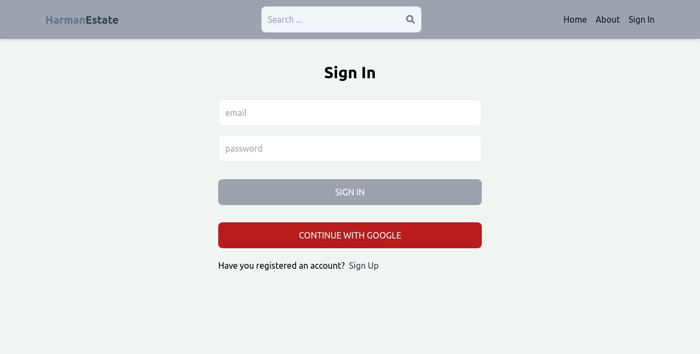

     

# React + Vite

This template provides a minimal setup to get React working in Vite with HMR and some ESLint rules.

Currently, two official plugins are available:

- [@vitejs/plugin-react](https://github.com/vitejs/vite-plugin-react/blob/main/packages/plugin-react/README.md) uses [Babel](https://babeljs.io/) for Fast Refresh
- [@vitejs/plugin-react-swc](https://github.com/vitejs/vite-plugin-react-swc) uses [SWC](https://swc.rs/) for Fast Refresh

# Ouath + jsonwebtoken 
1. User Authorization (OAuth Flow):
   - The OAuth flow typically involves three parties: the client application, the resource owner (user), and the authorization server.
     - The client application initiates the OAuth flow by redirecting the user to the authorization server.
        - The user authenticates and grants permission for the client application to access their data.
    The authorization server issues an access token to the client application.

2. Using JWT for Access Tokens:

    - Instead of a simple opaque access token, a JSON Web Token (JWT) can be used as the access token.
      - The JWT contains claims about the user and their permissions, encoded as a JSON object.
         - The client application can include the JWT in API requests to access protected resources.
             - The resource server (API server) needs to verify the integrity and authenticity of the JWT.
               - This involves checking the signature of the JWT using the public key of the authorization server (which signed the token).
                  - If the signature is valid, the resource server can trust the information in the JWT.

            # Node.js (JavaScript/TypeScript):

              - OAuth: Passport.js (with OAuth strategy)
               - JWT: jsonwebtoken library

               # bcrypt 
               - is a library for hashing passwords in JavaScript. It is commonly used for securely storing user passwords by hashing and salting them. The library uses the bcrypt algorithm, which is designed to be slow and computationally expensive, making it resistant to brute-force attacks.

               # MongoDB
                 - a popular, open-source NoSQL database that provides a scalable, flexible, and document-oriented storage system. It stores data in a format called BSON (Binary JSON), which is a binary-encoded serialization of JSON-like documents.